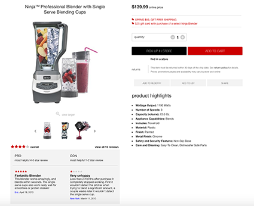
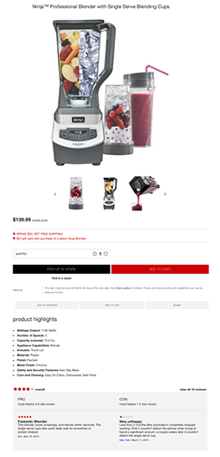
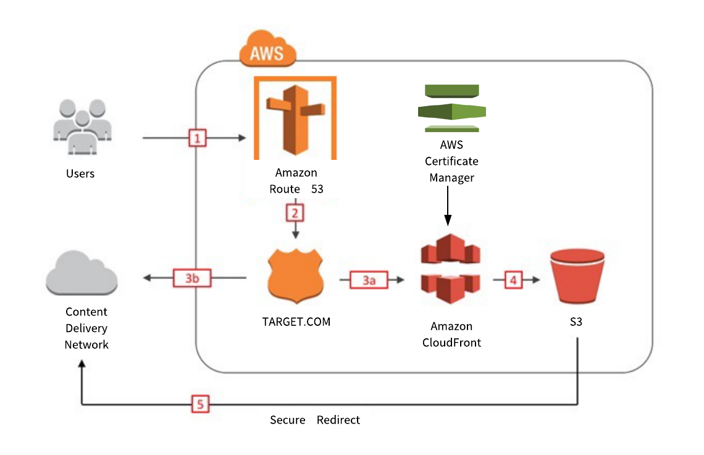

# Target Retail - Case Study – UI Front Case Study

## Case Study
myRetail is a rapidly growing company with HQ in Richmond, VA and over 200 stores across the east coast.  The company’s annual revenue last year was $5 billion and growing at the rate of 10% year over year.  myRetail sells general merchandise products, including a fast growing fresh grocery segment.  The stores average 80,000 sq. ft. in size and carry around 20,000 products. myRetail wants to provide a multi-channel experience for its customers online.

## Application Features/Requirements

**Responsive Design**
- Requirement: Use the provided design docs, desktop.psd and mobile.psd, as general guidelines to create the user interface.

_Desktop_

_Mobile_

**Provided JSON file imported into MongoDB Collection**

**Framework: Angular**

## Setup
1. Run `npm install`
2. Run `grunt`
3. If running the app locally, make sure Mongo is running `mongod`
    In Shell:
      
      `mongoimport -d targetcasestudy -c catalog item-data.json`

5. Start the server by running `npm start`

## Tests
The following test cases were created using Protractor.

- should have data to display on the DOM
- should display first three slides (carousel)
- should validate quantity not to be less than one
- should increase quantity when clicking on + icon and decrease when -
- should show both add to cart and pick up in store buttons when purchasingChannelCode is 0
- should show add to cart and hide pick up in store buttons when purchasingChannelCode is 1

To launch the application's tests:

    Make sure you have protractortest installed:
      - `sudo npm install -g protractor`
            
    Make sure you have installed webdriver manager:
      - 'sudo npm install -g webdriver-manager'
      - 'sudo webdriver-manager update'

    Make sure you have installed httpster:
      - 'sudo npm -g install httpster'

    After installation, run these commands in 3 different terminals:
      - 'sudo webdriver-manager start'
      - 'npm start'
      - 'npm test'
      
 **Continous Delivery Diagram**
 

 

